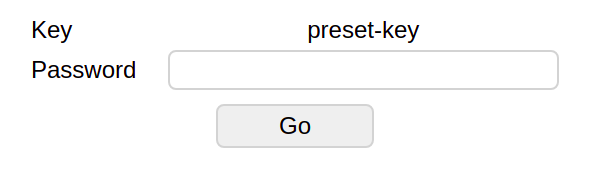

# Gate Keeper

> This project is archived in favor of the more mature [redirector](https://github.com/AmrSaber/redirector), they both provide the same functionality; and redirector is a lot more mature and has a lot more features.

Simple authenticate and redirect service, that shows a form asking you for a password, if the password is correct it redirects you to a pre-specified URL.

This projects depends on Redis database (maybe add support for more data stores later), and it offers 3 endpoints and 1 static HTML page. The whole idea is to serve the static page for a user so they enter their key (to differentiate different URLs) and related password, then get redirected to the desired page. 2 of the endpoints are to be used by the admins (PUT and DELETE requests), and the third one is used by the HTML page (GET request).

## Static page
You can access the static page at the root of the project (`/`) and it looks like the following  


And if you add a query param called `key` to the page with some value (the image below has the value `key=preset-key`) it will look like the following  


## Endpoints
### Set key: `PUT /api/keys` - Used by the admin
Puts a key. It replaces the whole saved resource with the given values, all of the values are required.

Body:
```ts
{
  key: string,
  password: string,
  url: string
}
```

Header:
```
Authorization: Bearer {ADMIN_TOKEN}
```
Where `ADMIN_TOKEN` is set in the env variables of the project.

### Delete key: `DELETE /api/keys/:key` - Used by the admin
Removes the key from the database.

Params:
```ts
{
  key: string // The key to be removed
}
```

Header:
```
Authorization: Bearer {ADMIN_TOKEN}
```
Where `ADMIN_TOKEN` is set in the env variables of the project.

### Get key: `GET /keys/:key` - Used by the static page
Gets the key

Params:
```ts
{
  key: string // The key to fetch the URL for
}
```

Header:
```
X-PASSWORD: {PASSWORD}
```
Where `PASSWORD` is the related password of that key (specified in the set endpoint)

Response:
```ts
{
  url: string // The related URL that was specified in the set endpoint
}
```

## Configuration
You will need to provide 3 environment variables via the `.env` file, you can make a copy of `.env.sample` file then rename it, those environment variables are:
- `PORT`: The port number that the project will listen on.
- `REDIS_URI`: The URI for the redis database.
- `ADMIN_TOKEN`: The token that is used by the admin for the PUT and DELETE endpoints.
